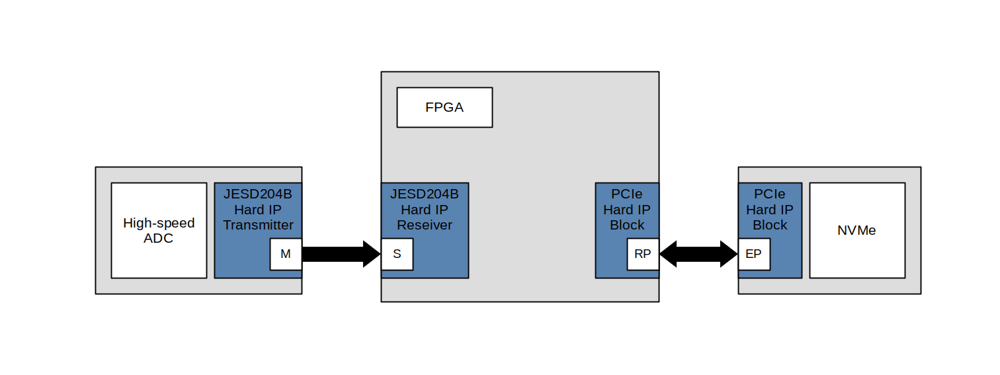
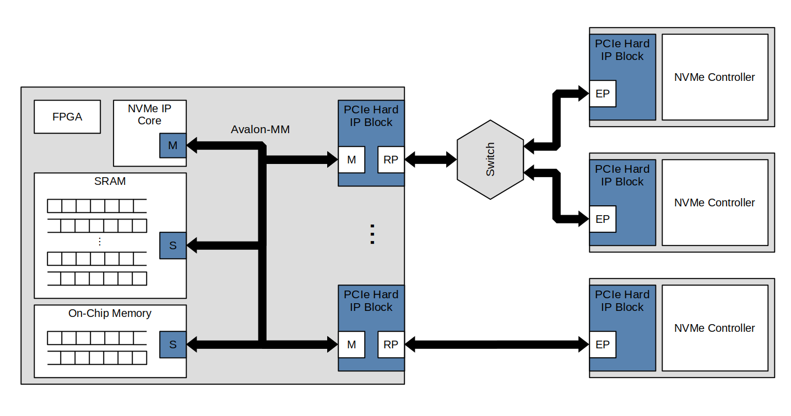
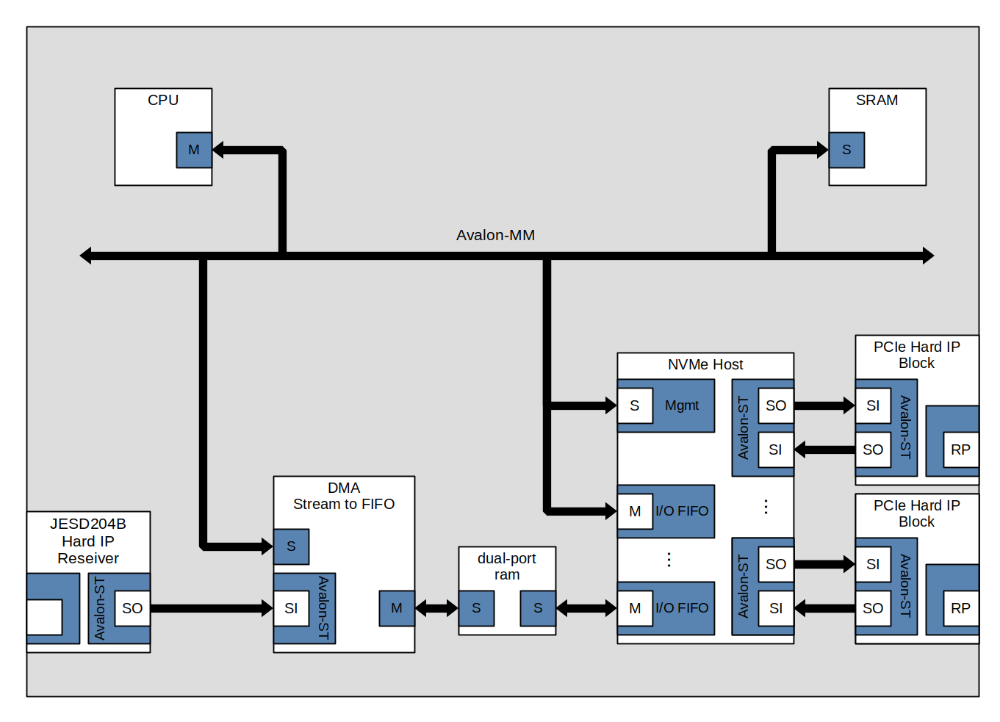

# NVMe Streaming

[https://github.com/DonMaestro/](https://github.com/DonMaestro/)nvme-ip

## Introduce

В даній документації описана концепція високошвидкісного запису даних на енергонезалежну пам’ять. Описана модель реалізовується на технологіях які присутніх на (ринку?). NVMe архітектура, яка працює на транспортній моделі PCIe (на основі пам’яті). Processor IP Core, PCIe Hard/Soft IP Core і т. ін.
В даному документі описаний принцип роботи, параметри компонентів, обрахунки, рекомендації. Також наведено базову концепцію NVMe, PCIe. Все це допоможе швидко додати енергонезалежну пам’ять до вашого проєкту.

На рисунку нижче наведено схему… До FPGA під’єднано через JESD204B високочастотний АЦП, який генерує IQ відліки. ???????

Архітектура підтримує 
Для прикладу взявши M.2 SSD key M, які підтримують PCIe x4. PCIe Gen 3 x4 дозволяє в теорію досягти 4GB/s.
Дозволяється додавати декілька портів так і працювати з декількома NVMe контролерами на одному порті через комутатор. Оскільки деякі NVM SSD повільні, комбінування декількох SSD на одному порті дозволить збільшити об’єм ?????????, але максимальну пропускну здатність порта.

Детальніше про компоненти описано в перерахованих файла:

[Theory of NVMe operation](Theory%20of%20NVMe%20operation%20f098025604aa4a4da64dbf2c9e0f968d.md)

[PCIe Hard IP Block [empty]](PCIe%20Hard%20IP%20Block%20%5Bempty%5D%20949f36a8bdcf48b3b0a3bb58d085f0ff.md)

[NVMe Client DMA](NVMe%20Client%20DMA%20eea798216e0f434ea93c2713e259f836.md)

[NVMe Host IP](NVMe%20Host%20IP%20cf4c09efcde1410480f942a7b66fa3d4.md)

[10Gb Ethernet [empty]](10Gb%20Ethernet%20%5Bempty%5D%2037d852c90c8545068d0fe2e2b506efc5.md)

[Interface [empty]](Interface%20%5Bempty%5D%20085a7c90706946d2a394bf988ada5aab.md)

Тут наведено варіант реалізацій в якому NVMe Host працює з PCIe Hard IP через Avalon-Streaming. Це дає деякі оптимізації. Для цього потрібно реалізувати власний DMA контролер, який входить до модуля NVMe Host.

Links

1. [nvme-streaming](https://devzone.missinglinkelectronics.com/index.php/nvme-streaming)
2. [data-capture-recorder](https://www.bittware.com/ip-solutions/data-capture-recorder/)
3. [The Arria 10 SoC SOM reference manual](https://www.intel.com/programmable/technical-pdfs/683711.pdf) (download)
4. [Intel Arria 10 Core Fabric and General Purpose I/Os Handbook](https://www.google.com/url?sa=t&rct=j&q=&esrc=s&source=web&cd=&ved=2ahUKEwiT3eCK7Y_8AhWG_CoKHWsjBpgQFnoECBMQAQ&url=https%3A%2F%2Fwww.intel.com%2Fprogrammable%2Ftechnical-pdfs%2F683461.pdf&usg=AOvVaw3oF1Lr0SmQKmuxr-HJH1Ko) (download)
5. [Intel Arria 10 CvP Initialization and Partial Reconfiguration over PCI Express User Guide](https://cdrdv2.intel.com/v1/dl/getContent/666700?fileName=ug_a10_cvp_prop-683871-666700.pdf)  (download)