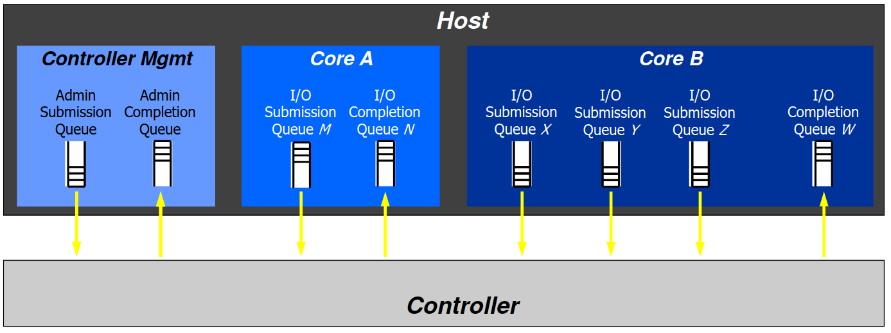

# Theory of NVMe operation

## Basic concept

В даному розділі буде описано концепція NVM Express (Non-Volatile Memory Host Controller Interface Specification). Основні компоненти наведені на рисунку нижче, а саме Host і Controller. Компонент Host містить черги. Controller знаходиться у NVM підсистемі. Дані компоненти працюють через транспортний протокол. В чергах зберігаються інструкції, які відправляються на виконання до контролера. В загальному можна сказати що Controller працює з Host, а навпаки. І в цьому можна буде переконатися під час читання цього розділу.

Програмне забезпечення хоста відповідає за створення черг подачі вводу/виводу та черг завершення вводу/виводу перед використанням цих пар черг для подачі команд на контролер.

## NVM Queues

### Queue Models

Існує Submission Queue (черга подання) та Completion Queue (черга завершення).
Черга реалізована на кільцевому буфері (ring buffer). Він має два показниках, head і tail. Переповнення відбувається коли покажчик tail знаходиться перед покажчиком head на одиницю менший з врахування стрибка, джерело 2.a рисунко 77 та 78. Більше в джерелі 2.a підрозділ 3.3 (91 с).

### Priority

Джерело 2.a [рисунок 102](https://nvmexpress.org/wp-content/uploads/NVM-Express-Base-Specification-2.0c-2022.10.04-Ratified.pdf#%5B%7B%22num%22%3A180%2C%22gen%22%3A0%7D%2C%7B%22name%22%3A%22XYZ%22%7D%2C69%2C720%2C0%5D). Хост не враховує пріоритетність черг, оскільки послідовність виконання інструкцій в наявних чергах визначає контролер.Кузнецов запропонував

### Phase Tag

В розділі [3.3.3.2.2 Phase Tag](https://nvmexpress.org/wp-content/uploads/NVM-Express-Base-Specification-2.0c-2022.10.04-Ratified.pdf#%5B%7B%22num%22%3A173%2C%22gen%22%3A0%7D%2C%7B%22name%22%3A%22XYZ%22%7D%2C69%2C380%2C0%5D) наведено метод позначення контролером виконаних ним інструкцій. ++++++++++++++++++++++++++++

### Creating I/O Queue

Черги подачі вводу/виводу та черги завершення вводу/виводу створюються за допомогою команди Create I/O Submission Queue ([див. розділ 5.5](https://nvmexpress.org/wp-content/uploads/NVM-Express-Base-Specification-2.0c-2022.10.04-Ratified.pdf#%5B%7B%22num%22%3A246%2C%22gen%22%3A0%7D%2C%7B%22name%22%3A%22XYZ%22%7D%2C69%2C308%2C0%5D)) та команди Create I/O Completion Queue ([див. розділ 5.4](https://nvmexpress.org/wp-content/uploads/NVM-Express-Base-Specification-2.0c-2022.10.04-Ratified.pdf#%5B%7B%22num%22%3A244%2C%22gen%22%3A0%7D%2C%7B%22name%22%3A%22XYZ%22%7D%2C69%2C601%2C0%5D)), які подаються в чергу подання адміністратора. Перед цим хост повинен виділити пам’ять для черги яка створюється. При створення черга показники head та tail повинна вказувати на нульому комірку, це означає що черга являється пустою.

## Взаємодія

В посиланні 2.b пункт 3.4.1 описана концепція взаємодії хоста з контролером використовуючи транспортний протокол на основі пам'яті.

Розглянемо приклад, запису на енергонезалежну пам’ять.

Клієнт записує інструкція в чергу подання та інкрементує значення показника tail. Host відправляє оновлений показник tail до Controller. Controller отримавши нове значення звіряє з позником head цієї черги. Виначившись що в черзі знаходиться інструкції. Controller відправляє хосту пакет на читання даної комірки черги, задавши адресу комірки та розмір комірки, який складає 64 bytes. Отримавший інструкцію Controller починає виконувати її. Для цього Controller формує пакет читання буфера з корисними даними на які зсилається в інстукції. Отримавши дані записує їх на енергонезалезну пам’ять і формує інструкцію звіт. Знаючи відношення черги подання до черги завершення формує адресу та відправляє її. Після цього Controller може додатково сповістити Host сформувавши переривання. Controller не сповіщає Host про інкрементування показника head черги подання та завершення, хоча це робить для себе. Controller вказує про наявносні інструкції в чергі завершення за допомогою біта Phase Tag. Отже клієнт дізнається про інструкцію в черзі завершення. Читає її та інкрементує значенн head в чергі завершення. Оскільки для кожної інструкції в чергі подання є відповідна інструкція в черзі завершення то показник tail в черзі завершення збігається показник head в черзі подання. Host відправляє оновлений показник head чергий завершення до Controller. Controller в свою чергу дізнається про стан чергий завеншення.

Links:

1. [Linux NVMe Driver presentation](https://www.flashmemorysummit.com/English/Collaterals/Proceedings/2013/20130812_PreConfD_Busch.pdf)
2. [NVM Express Specification](https://nvmexpress.org/specifications/)
    1. [NVM Express Base Specification 2.0c](https://nvmexpress.org/wp-content/uploads/NVM-Express-Base-Specification-2.0c-2022.10.04-Ratified.pdf) 20c
    2. [NVM Express PCIe Transport Specification 1.0c](https://nvmexpress.org/wp-content/uploads/NVM-Express-PCIe-Transport-Specification-1.0c-2022.10.03-Ratified.pdf)
    3. [NVM Express Management Interface Specification-1.2c](https://nvmexpress.org/wp-content/uploads/NVM-Express-Management-Interface-Specification-1.2c-2022.10.06-Ratified.pdf)
    4. [NVMe over Fabrics 1.1a](https://nvmexpress.org/wp-content/uploads/NVMe-over-Fabrics-1.1a-2021.07.12-Ratified.pdf)
3. [NVMe IP from the Design Gateway](https://dgway.com/products/IP/NVMe-IP/dg_nvmeip_refdesign_en.pdf)
4. [https://sata-io.org/system/files/member-downloads/NVMe and AHCI_ _long_.pdf](https://sata-io.org/system/files/member-downloads/NVMe%20and%20AHCI_%20_long_.pdf)
5. [NVMe PCIe SSD M.2 Manual](https://www.vikingtechnology.com/wp-content/uploads/2021/03/M2_80mm_PCIeNVMe_Phison_PS5007.pdf)