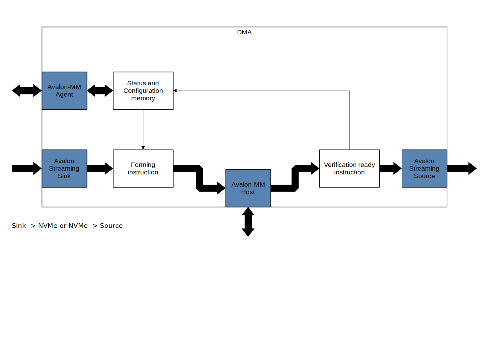

# NVMe Client DMA

Клієнт повинен записувати потік інформаціх в буфер.

## Parameters

Ту потрібно описати яка конфігурація модуля буде в Platform Design при додаванні компонента.

Клієнт повинен мати такі можливості:

- відокремлений порт для даних та інструкцій
- 

links:

1. [https://en.wikipedia.org/wiki/Direct_memory_access](https://en.wikipedia.org/wiki/Direct_memory_access)
2. [https://www.xilinx.com/products/intellectual-property/axi_dma.html](https://www.xilinx.com/products/intellectual-property/axi_dma.html)